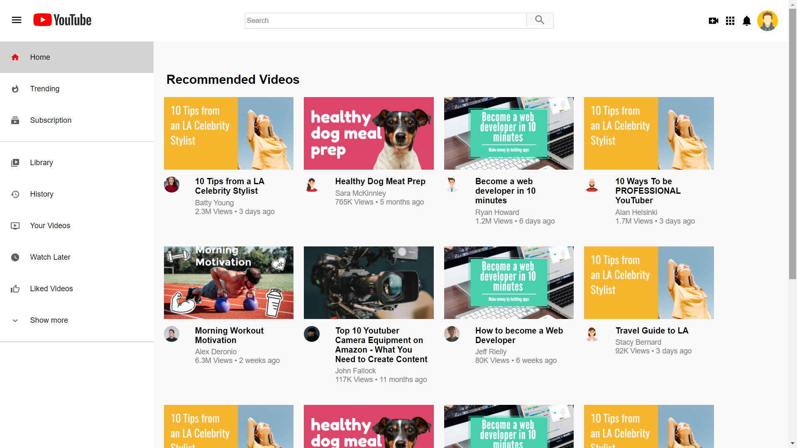

# Youtube-Clone
This project is build to resemble the features of Youtube.
This is a React web app.
This is one of the fun projects that I had done not only playing with React, react-router but also using Flexbox and Material_UI to it's extent.

#To see the live demo of the app, please click the below link -
[https://clone-361ba.web.app](https://clone-361ba.web.app)

# My cool project and above is the screenshot of it

Created on top of create-react-app I used Flexbox for styling and and Material-UI for various icons and avatars. 

Using react-router I am able to make the search bar and the home button work. It actually routes to a different page. Feel free to play with it. 

It is completely responsive and can be used in mobile devices.

All the classnames are written following the BEM convention and used to style the specific components. 
Each section is break down into it’s own components.

# The components goes like this - 
* Header
* Sidebar
* RecommendedVideos
* SidebarRow
* VideoCard
* VideoRow
* SearchPage
* ChannelRow

# Tech stack used to build the app - 
* React
* React-router
* Firebase
* Material-UI
* Flexbox
* CSS3
* HTML5
